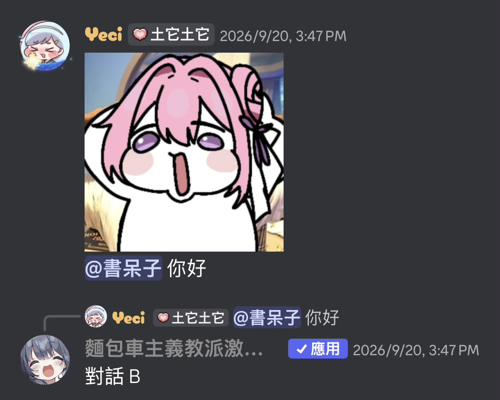
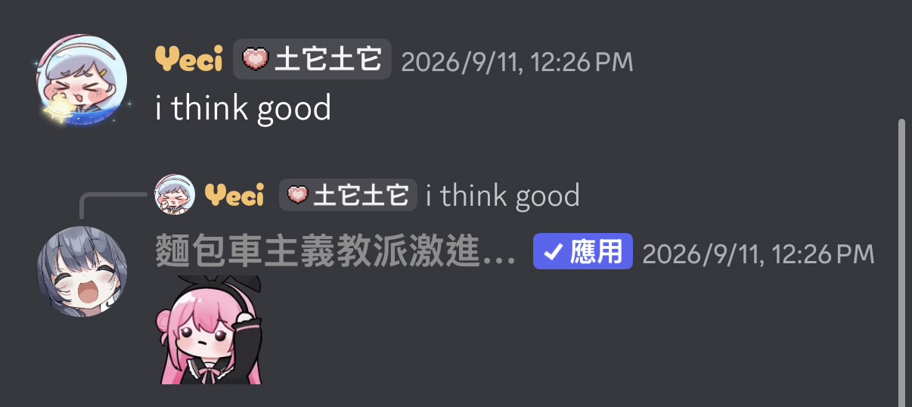
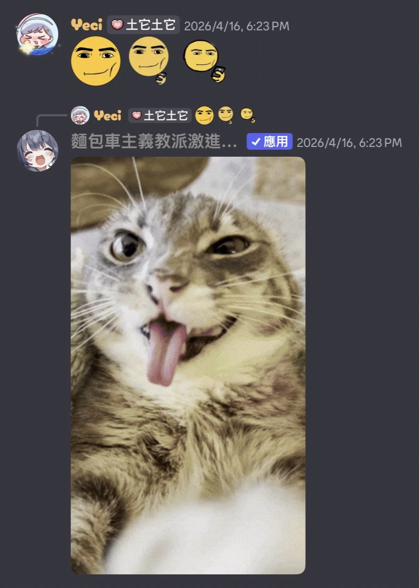

# Outo Message Content Intent: usage examples

Application: **Outo / 奧托**, Discord application ID **998462106250784888**.

These existing screenshots were supplied by the application owner for the 2026 intent review. The bot appears under a server-specific display name beginning with `麵包車主義教派激進…`, rather than its application name. The screenshots alone do not expose the application ID.

Outo reads ordinary server message text and compares it against server-configured exact, substring or regular-expression rules. It then sends a predefined reply. Users do not need to invoke a slash command or mention Outo for each trigger. Slash commands and forms are used to configure the rules.

## Example 1: message text followed by a configured text reply

The user's message contains `你好` and a mention. The application replies `對話 B`. The message also includes an image, but this example does not claim the bot recognizes or analyzes that image. The screenshot does not establish whom the mention targets; examples 2 and 3 show the ordinary-message use case more directly.

## Example 2: ordinary text followed by a visual reply

The user sends `i think good` without a visible command or mention. The application replies with a configured visual response. This illustrates the automatic-reply experience that would be lost if every message required a slash command or a mention of the bot.

## Example 3: emoji message followed by a visual reply

The user sends a message containing custom emoji without a visible command or mention. The application replies with a configured visual response. Custom emoji have a textual representation in Discord message content; this does not require image recognition.

These screenshots show existing input/output behavior. They do not show the exact configured matching rules, so they are not presented as proof of a particular regex, probability or matching mode.

## Why Message Content is needed

The core feature matches ordinary, unprompted server messages in channels allowed by server settings. Without Message Content access, messages outside Discord's content exceptions do not provide the text needed for that comparison. Requiring a command, direct message or bot mention would change this core behavior. Outo requests only Message Content among the privileged intents, not Server Members or Presence.

Incoming conversation text is processed in memory and is not archived by the auto-reply handler. Server-supplied rules and action records are stored separately. See the [privacy policy](../LICENSE) for storage, retention and available controls.
